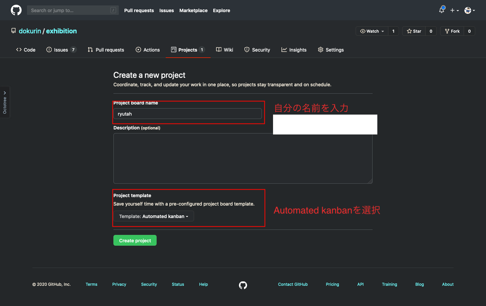
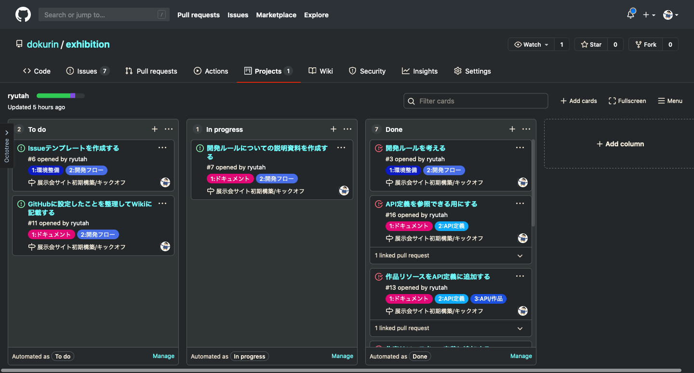
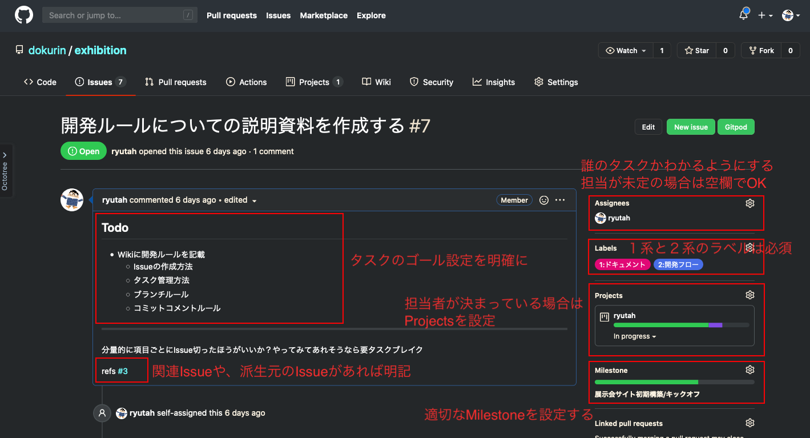
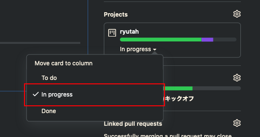
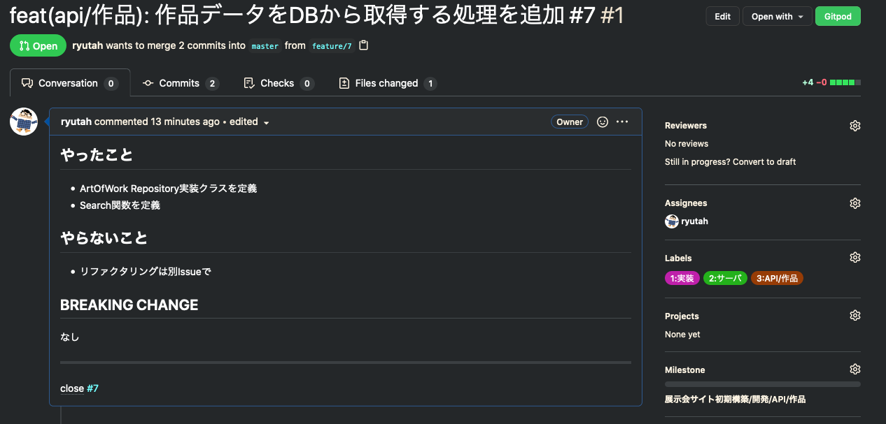
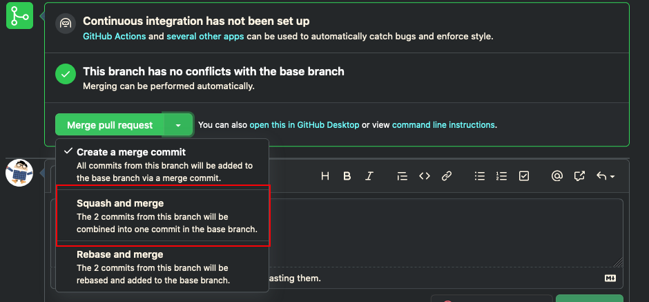
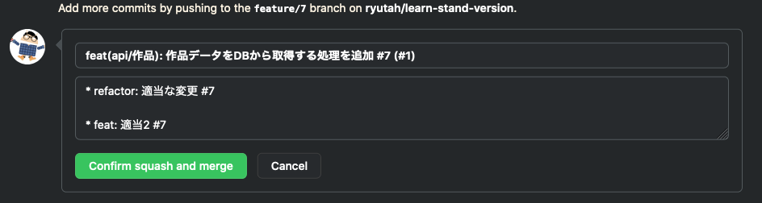

# 開発ルール

開発する上での決まりごとについてを記載する

開発ルールを守ることはチーム開発でとっても重要だゾ！

## 開発ルール心得

- 辛いルールがあったらみんなに相談してちゃんと改善のための議論をしよう
- なんでこの開発ルールがあるのかを考えて取り組もう
  - タスクは見えなきゃ管理できない
  - コードの変更はトラッキングできないと保守できない
  - etc...
- 改善のためのアイデアがあれば積極的に提案しよう
- ルールは自分のためにだけじゃなく、周りのみんなのためにも守るもの

ただ従うだけじゃなくて運用しづらいものがあれば改善提案をしていくことでチームを強くしていくんだ！

## 開発フロー

[GitLab Flow](https://docs.gitlab.com/ee/topics/gitlab_flow.html) をベースとして、次の流れでマージをしていく

```txt
topic branch -> master -> test -> staging -> production
```

### ブランチの説明

| branch       | 説明                                                                                                          |
|--------------|---------------------------------------------------------------------------------------------------------------|
| topic branch | 作業ブランチ<br>`[topic]/[ISSUE_NUMBER]` の形式<br>topicに関しては [ブランチのtopic](#ブランチのtopic) を参照 |
| master       | ベースブランチ                                                                                                |
| test         | 検証環境リリースブランチ<br>このブランチにコードがPushされるとテスト環境へデプロイが走る                      |
| staging      | ステージング環境リリースブランチ<br>このブランチにコードがPushされるとステージング環境へデプロイが走る        |
| production   | ステージング環境リリースブランチ<br>このブランチにコードがPushされると本番環境へデプロイが走る                |

## Basic Rule

### 1. GitHub Projectsを作成する



#### 開発中のProjectsのイメージ



### 2. Issueを作成する



⚠ **Issueのサイズはなるべく小さくしよう。一日で終わるレベルのサイズ感が理想**

### 3. ブランチを作成する

`master` ブランチをベースに `[作業分類]/[ISSUE_NUMBER]` のフォーマットでブランチを作成する

#### 例

```console
git checkout -b feat/7
```

### 4. IssueをIn progressに移動して作業を開始



### 5. 差分をコミット/Pushする

PRのマージ時にSquashマージを用いてマージをするため特に指定は無いが、 [Conventional Commits](https://www.conventionalcommits.org/ja/v1.0.0/)
のフォーマット( `<type>[optional scope]: <description>` )でコミットメッセージを書くのが望ましい(Bodyは書きたかったら書いていいよ)

typesについては[コミットメッセージ、PRタイトルのtype](#コミットメッセージprタイトルのtype) を、scopeについては [コミットメッセージ、PRタイトルのscope](#コミットメッセージprタイトルのscope) を参照

#### 例

```txt
feat(api/作品): 作品ドメインを追加 #123
```

### 6. Pull Requestを作成する



| フィールド      | Required | 説明                                                                                                                                   |
|-----------------|----------|----------------------------------------------------------------------------------------------------------------------------------------|
| タイトル        | O        | [Conventional Commits](https://www.conventionalcommits.org/ja/v1.0.0/) 形式<br>`<type>[optional scope]: <description> #<issue_number>` |
| やったこと      | O        | 変更内容の概要                                                                                                                         |
| やらないこと    | X        | このPRではやらないことを<br>特になければ `なし` でおｋ                                                                                 |
| BREAKING CHANGE | X        | 破壊的な変更がある場合は記載<br>特になければ `なし` でおｋ                                                                             |
| Issue number    | O        | 対応するIssueの番号<br>closeコメントとか使うと便利                                                                                     |
| Reviwers        | O        | レビューして貰う人を指定する(サンプル画像は適当なリポジトリでサンプル作ってるのでレビュアー指定できてない)                             |
| Assinees        | O        | PR出した人(基本自分になるはず)                                                                                                         |
| Labels          | O        | 対応するIssueと同じものをつける                                                                                                        |
| Projects        | X        | 指定不要。つけたかったらつけて                                                                                                         |
| Milestone       | X        | 対応するIssueと同じものをつける                                                                                                        |

### 7. PRをマージする

レビュアーから `Approve` をもらったら **PRを出した人** がコードのマージを行う

マージの際は **Squash Merge** をすること





| フィールド | 説明                                                                                                                                                                                          |
|------------|-----------------------------------------------------------------------------------------------------------------------------------------------------------------------------------------------|
| タイトル   | PRのタイトルと同様でOK<br>デフォルトでそうなってるはず                                                                                                                                        |
| やったこと | 変更内容に合わせて適当なものを(デフォルトではPRに含まれてるコミットメッセージが入る)<br>**BREAKING CHANGEがある場合は必ず次のフォーマットで記載すること**<br>`BREAKING CHANGE: <description>` |

## Tips

### ブランチのtopic

| topic    | 説明                                     |
|----------|------------------------------------------|
| feat     | 機能の追加                               |
| fix      | Bugfix                                   |
| refactor | コードリファクタリング                   |
| pref     | パフォーマンスの改善                     |
| ci       | CIに関する変更                           |
| docs     | ドキュメントの変更                       |
| style    | コードフォーマット、スタイルに関する変更 |
| test     | 不足しているテストコードの追加           |
| chore    | その他雑多な変更                         |

### コミットメッセージ、PRタイトルのtype

| type     | 説明                                     |
|----------|------------------------------------------|
| feat     | 機能の追加                               |
| fix      | Bugfix                                   |
| refactor | コードリファクタリング                   |
| pref     | パフォーマンスの改善                     |
| ci       | CIに関する変更                           |
| docs     | ドキュメントの変更                       |
| style    | コードフォーマット、スタイルに関する変更 |
| test     | 不足しているテストコードの追加           |
| chore    | その他雑多な変更                         |

_[Angular#Commit Message Guidelines](https://github.com/angular/angular/blob/22b96b9/CONTRIBUTING.md#-commit-message-guidelines) をベースにしている_

### typeに悩んだら

- 関数の追加とかって何を使えばいいの？
  - featです
- 一つ前のPRでマージしたコードがバグってたから修正したんだけどこれってfix？
  - choreです。fixは前のバージョンのバグを修正した場合に使います
- 機能を追加するついでに、コードのリファクタリングもしちゃったんだけどこういうときはどうすればいいの？
  - featでいいです
- どうしてもどれつけていいかわかんない、、、
  - typeを追加する必要があるかも。Issueを建ててみんなと相談しよう

### コミットメッセージ、PRタイトルのscope

対応するIssueの分類3ラベルとと同じものをつける

Issueに分類3のラベルがない場合はいらない
